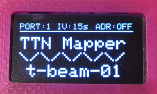
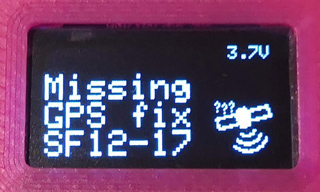
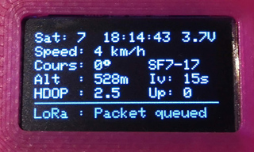

## Intro

This is a simple sketch demonstrating the capability of the [TTGO T-Beam](https://www.aliexpress.com/store/product/TTGO-T-Beam-ESP32-433-868-915Mhz-WiFi-wireless-Bluetooth-Module-ESP-32-GPS-NEO-6M/2090076_32875743018.html) as a [TTN Mapper](https://ttnmapper.org/) Node on [The Things Network](https://www.thethingsnetwork.org/) LoraWAN.

This repo contains a patched SSD1306 library from [smartnick](https://github.com/smartinick/Adafruit_SSD1306), enabling individual I²C pins and to set I²C Clock to 800kHz.

## History

* [cyberman54/ESP32-Paxcounter](https://github.com/cyberman54/ESP32-Paxcounter)
    - ESP32 + LoRa uplink/downlink working example
* [Edzelf/LoRa](https://github.com/Edzelf/LoRa)
    - LoRa examples
* [sbiermann/Lora-TTNMapper-ESP32](https://github.com/sbiermann/Lora-TTNMapper-ESP32)
    - Use an ESP32 + GPS + LoRa as a TTN Mapper device
* [DeuxVis/Lora-TTNMapper-T-Beam](https://github.com/DeuxVis/Lora-TTNMapper-T-Beam)
    - Support for TTGO ESP32 T-Beam board
    - Wait for GPS fix
    - Improve GPS code
    - Reduce power consumption
    - Store frame counters
    - Support OTAA and ABP
    - Add untested support for US902-928
* [Bjoerns-TB/Lora-TTNMapper-T-Beam](https://github.com/Bjoerns-TB/Lora-TTNMapper-T-Beam)
    - Use the T-Beam OLED for information
    - Display LoRa, battery status on OLED
* [hottimuc/Lora-TTNMapper-T-Beam](https://github.com/hottimuc/Lora-TTNMapper-T-Beam)
    - Add non-blocking GPS scanning
    - Display more info on OLED
    - Selectable data rate and power
    - Selectable transmit interval
    - Selectable ADR mode
    - Selectable send port
    - Support newer hardware power management chips
    - Allow dimming of display

### Other Forks

Some of these other forks are not integrated into this repository, but may be useful for you.

* [palbeda/Lora-TTNMapper-T-Beam](https://github.com/palbeda/Lora-TTNMapper-T-Beam)
    - Support Cayenne TTN Integration based on TTGO-BEAM-CAR_TRACKER code
    - Support Adafruit BMP280 Temperature/Humidity/Barometric Pressure sensor
* [MichaelEFlip/Lora-TTNMapper-T-Beam](https://github.com/MichaelEFlip/Lora-TTNMapper-T-Beam)
    - Convert to use [Platform IO](https://platformio.org)
* [radforschung/Lora-TTNMapper-T-Beam](https://github.com/radforschung/Lora-TTNMapper-T-Beam)
    - Use [MCCI LMIC Arduino](https://github.com/mcci-catena/arduino-lmic) fork; requires manual library editing
    - Support an IMU (e.g. MPU 9250) for wake
    - Adjusted battery voltage measurements
* [PA4WD/Lora-TTNMapper-T-Beam](https://github.com/PA4WD/Lora-TTNMapper-T-Beam)
    - Support ublox neo-7m module
* [r8420/Lora-TTNMapper-T-Beam](https://github.com/r8420/Lora-TTNMapper-T-Beam)
    - Adds OTAA support and sleep modes
* [pulento/Lora-TTNMapper-T-Beam](https://github.com/pulento/Lora-TTNMapper-T-Beam)
    - Use Platform IO
    - Support US902-928
    - Force 903.9 MHz for transmit
    - Add downlink support
* [pamribeirox/Lora-TTNMapper-T-Beam](https://github.com/pamribeirox/Lora-TTNMapper-T-Beam)
    - Send dummy LoRa packets if missing GPS fix
* [noppingen/Lora-TTNMapper-T-Beam-v10](https://github.com/noppingen/Lora-TTNMapper-T-Beam-v10)
    - Case design available
* [kizniche/ttgo-tbeam-sensor-node-bme280](https://github.com/kizniche/ttgo-tbeam-sensor-node-bme280)
    - Support BME280 Temperature/Humidity/Barometric Pressure sensor
    - Support US902-928 and EU863-870
* [FabTangi/ttgo-ttn-ds18b20](https://github.com/FabTangi/ttgo-ttn-ds18b20)
    - Support US902-928 and AU915-928
* [tekk/TTGO-T-Beam-Car-Tracker](https://github.com/tekk/TTGO-T-Beam-Car-Tracker)
    - Cayenne backend for visualization
    - BME280 support

## Sample Images



## Software dependencies

Arduino IDE [ESP32 extension](https://github.com/espressif/arduino-esp32)

[TinyGPS++](http://arduiniana.org/libraries/tinygpsplus/)

[LMIC-Arduino](https://github.com/matthijskooijman/arduino-lmic) : Make sure to get the last version - *1.5.0+arduino-2* currently - because the arduino IDE library updater is getting confused by the versioning scheme of that library.

[AXP202X Library](https://github.com/lewisxhe/AXP202X_Library) is needed for V08 and up.

## Instructions

You can program the T-Beam using the [Arduino ESP32](https://github.com/espressif/arduino-esp32) board 't-beam'.

It is suitable for t-beam HW-Version up to V07 (use folder "uptoV07") and higher versions with Soft-Power-Button (use folder "fromV08").

On The Things Network side, the settings needed are available [here](https://www.thethingsnetwork.org/docs/applications/ttnmapper/).

Configure the Payload decoder with:

```javascript
function Decoder(bytes, port) {
    var decoded = {};

    decoded.latitude = ((bytes[0]<<16)>>>0) + ((bytes[1]<<8)>>>0) + bytes[2];
    decoded.latitude = (decoded.latitude / 16777215.0 * 180) - 90;
  
    decoded.longitude = ((bytes[3]<<16)>>>0) + ((bytes[4]<<8)>>>0) + bytes[5];
    decoded.longitude = (decoded.longitude / 16777215.0 * 360) - 180;
  
    var altValue = ((bytes[6]<<8)>>>0) + bytes[7];
    var sign = bytes[6] & (1 << 7);
    if(sign)
    {
        decoded.altitude = 0xFFFF0000 | altValue;
    }
    else
    {
        decoded.altitude = altValue;
    }
  
    decoded.hdop = bytes[8] / 10.0;

    return decoded;
}
```
